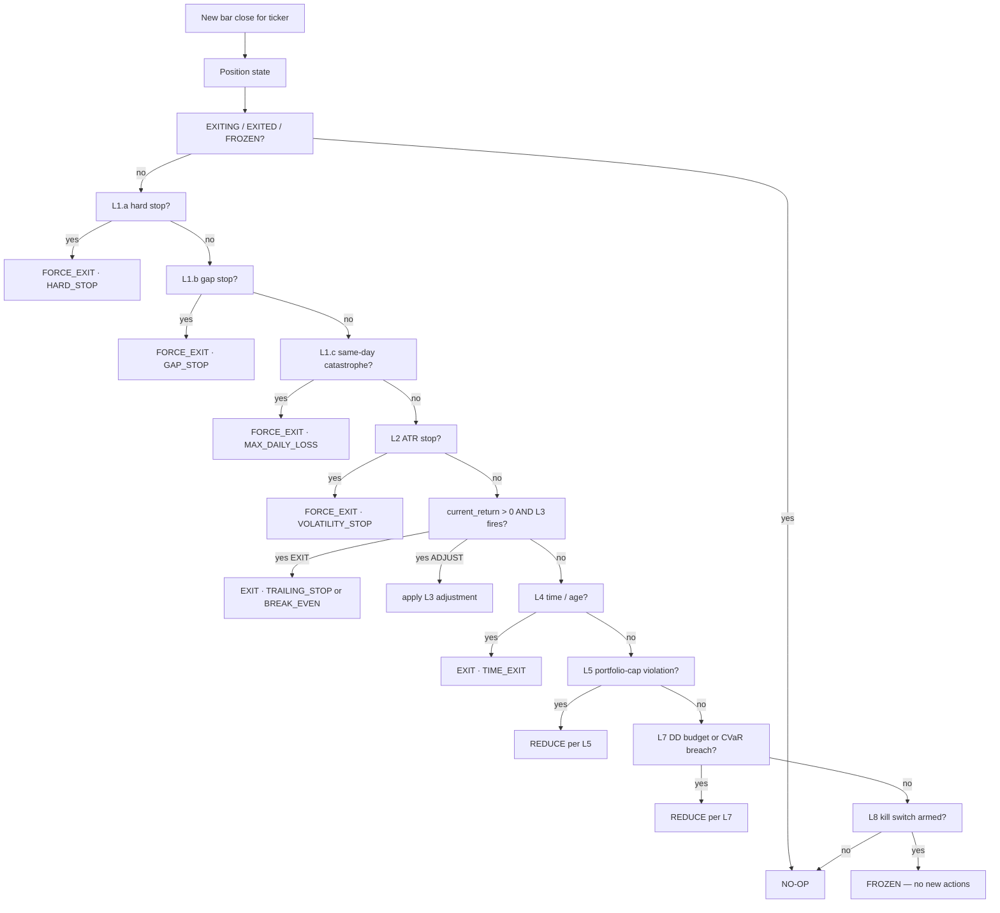

# ARCH002 — Institutional Exit & Capital Preservation Framework

**Document type:** Constitutional architecture (design only)
**Status:** DRAFT · design only · NO code · NO strategy change · NO parameter tuning · NO production changes
**Owner role:** Chief Risk Officer · Quant Architect · Portfolio Risk Engineer · Head of Research
**Author:** AEGIS engineering
**Date opened:** 2026-07-17
**Related work:**
- Grounded in the empirical evidence produced by [`RISK001-A1`](../research/RISK001-A_RESULTS.md) on 285 historical positions
- Supersedes the exit-controller scoping in [`RISK001-B`](RISK001-B_RISK_CONTROLLER_ARCHITECTURE.md) §3–§8 (kept as component detail; ARCH002 is the framework)
- References the institutional-practice survey in [`Executive Summary.pdf`](../Executive%20Summary.pdf) (11 pages, tracked in git for durable citation)
- Constitutional input to any future `RISK001-C` implementation
- **Sealed files touched: 0. Production code touched: 0. Parameters tuned: 0.**

---

## 0.  Preamble — non-negotiables

1. This document is **architecture**, not implementation.
2. No production code is changed, added, or removed.
3. No strategy parameter is changed (`HOLD=63`, `rebal=63`, `sector_cap=2`, `name_cap=0.30`, `method=hrp`, `cumulative_strategy_search=38` all remain frozen).
4. No sealed file is touched.
5. The parameters shown in this document (5%, 7%, 2×ATR, 10% portfolio DD, 63d hold) are **placeholders derived from the RISK001-A1 evidence + literature survey**. They are **not adopted**. Any adoption requires the operator's explicit decision on the primary decision metric (see [RISK001-A results §9](../research/RISK001-A_RESULTS.md)) and passage through the four-phase rollout of §14.
6. `MANUAL_OVERRIDE_INCREASE_RISK` is structurally impossible. The only permitted overrides are ones that reduce risk.

---

## 1.  Mission (from operator, verbatim)

> **Rule 1.** Never lose capital unnecessarily.
> **Rule 2.** Preserve capital before pursuing return.
> **Rule 3.** Large losses are unacceptable.
> **Rule 4.** Small losses are business expenses.
> **Rule 5.** Profits may be unlimited.
> **Rule 6.** Risk must always be bounded.

These six rules are the top-level design principle. Every layer, every state transition, every override, and every learning signal in the rest of this document must obey them. If a proposal in some future spec would violate any of them, the proposal is rejected without discussion.

Extending from [`RISK001-B` §1](RISK001-B_RISK_CONTROLLER_ARCHITECTURE.md), the AEGIS Investment Constitution now reads:

| # | Rule | Notes |
|:-:|:--|:--|
| 1 | Never lose capital unnecessarily | "Unnecessarily" = "when a deterministic pre-defined rule would have prevented the loss" |
| 2 | Preserve capital before pursuing return | Capital-preservation Layers (1–2, 7) short-circuit portfolio-optimisation Layer (8) |
| 3 | Large losses are unacceptable | "Large" ≡ any single-position loss beyond `hard_stop_pct` (computed per-position at entry) |
| 4 | Small losses are business expenses | Losses *within* the hard-stop budget are the cost of doing business; no attempt to eliminate them |
| 5 | Profits are unlimited | No rule caps the upside; trailing stops adjust upward; break-even releases; time-decay tightens but never caps |
| 6 | Risk must always be bounded | Every position has known max-loss in ₹ and % of portfolio at entry; portfolio has known max-drawdown budget |
| 7 | The Risk Controller has veto power | No score, no HRP weight, no operator override can prevent an exit that Layers 1–2 or 7 flag |
| 8 | When uncertain, reduce risk | Missing data, unknown regime, null confidence, signal conflict → REDUCE, never HOLD_LARGER (from [`RISK001-B` §1 Rule 6](RISK001-B_RISK_CONTROLLER_ARCHITECTURE.md)) |

---

## 2.  Position of this framework in the AEGIS pipeline

```
     Market data (parquets, adjusted OHLCV)
                       │
                       ▼
              Recommendation engine
                       │
                       ▼
              Portfolio optimiser (HRP)
                       │
                       ▼
    ┌──────────────────────────────────────────┐
    │        ARCH002 EXIT & CAPITAL-PRESERVATION      │
    │        FRAMEWORK (9 layers, priority-ordered)    │
    │                                                    │
    │   L0 → L1 → L2 → L3 → L4 → L5 → L6 → L7 → L8      │
    └──────────────────────────────────────────┘
                       │
                       ▼
    Final action set  →  Telegram · Google Sheets · DB · Audit
```

The framework is the deterministic decision function that takes the optimiser's proposed action set and produces the final action set. Everything between the "Portfolio optimiser" node and the "Final action set" node is *this document*.

**Binding property.** The optimiser's output is advisory. The framework's output is binding. This is not adjustable by configuration.

---

## 3.  Institutional-practice survey

The 9-layer architecture in §4 is not invented — it is a synthesis of publicly-documented practices at institutional firms plus 30+ years of academic literature. This section grounds every design choice in a specific practitioner or paper.

### 3.1  Firm-by-firm summary (public information only)

| Firm | Domain | Publicly-known risk-management primitives | What ARCH002 borrows |
|:--|:--|:--|:--|
| **Renaissance Technologies** | Systematic equity + futures | Very short holding periods; per-signal risk budgeting; models retrained continuously; strict correlation limits | Continuous re-evaluation of risk budget (Layer 5); correlation caps (Layer 5) |
| **Two Sigma** | Multi-strategy quant | ML-driven models with strict risk overlays; factor-neutral portfolios; centralised risk desk with veto | Risk-desk veto pattern (framework binding over optimiser); factor exposure caps (Layer 5) |
| **AQR Capital** | Factor investing (value/momentum/quality/low-vol) | Volatility targeting per strategy; drawdown budgets; extensive academic publication of methods | Volatility targeting inside Layer 2; drawdown budget (Layer 7) |
| **Citadel** | Multi-strategy (equities, fixed income, commodities) | Per-PM risk budgets; centralised risk system with automatic de-risking on drawdown; strict circuit breakers | Per-position and portfolio-level circuit breakers (Layer 8); automatic de-risking |
| **Man AHL** | Trend-following CTA (managed futures) | Volatility scaling; trailing stops per instrument; portfolio heat targeting; documented in academic papers | ATR-scaled hard stop (Layer 1); trailing stop (Layer 3); volatility targeting (Layer 2) |
| **Bridgewater** | Global macro / risk parity | Risk parity = equal risk contribution per asset; scenario stress-testing; drawdown control | Equal-risk-contribution framing for portfolio risk (Layer 6 concept); stress-testing (§9) |
| **WorldQuant** | Alpha research crowd-sourcing | Alpha library approach; every strategy has a formal risk profile; drawdown control via ensembling | Every position has a fingerprint / risk profile at entry (§5.L0) |
| **Jane Street** | Market-making (equities, options) | Real-time position monitoring; strict per-trader risk limits; kill switches on unusual P&L | Real-time monitoring (Layer 5); kill switch (Layer 8) |
| **Generic CTA consensus** | Managed futures | Documented in CME Group 2017: multiple layers (single-stock stop 4–6% + portfolio stop 5–10% DD + volatility scaling) | The three-tier layered structure that anchors ARCH002 |

**Caveat.** No firm publishes its production risk system verbatim. Every claim above is either from published academic papers, CME/industry consensus documents, marketing white-papers, or the Executive Summary PDF's references. ARCH002 does not claim to *replicate* any firm; it *synthesises* the common patterns.

### 3.2  Academic literature (from `Executive Summary.pdf` §1)

| Paper / source | Finding | Layer(s) informed |
|:--|:--|:--|
| Kaminski & Lo (2007) — "When Do Stop-Loss Rules Stop Losses?" | Stops improve Sharpe only when return autocorrelation > strategy Sharpe (i.e. trending regimes) | Layer 1 (hard stop) + Layer 6 (regime dependency) |
| Han (2018) — "Taming Momentum Crashes" | A 10% stop dramatically reduces crashes in U.S. momentum strategies | Layer 1 threshold-band selection |
| Snorrason & Yusupov (2009) | Fixed and trailing stops outperformed buy-and-hold on Swedish stocks (1998-2009) | Layer 1 + Layer 3 combination |
| Arratia & Dorador (2019) | Overnight gap risk is material; simulations including gap-through improve realism | Layer 1b (gap-stop) design |
| Research Affiliates (2025) — "Stop the Losses!" | Stops: no Sharpe gain net-of-cost, but large drawdown reduction — worth it for downside control | Confirmed by RISK001-A1 evidence; Layer 1 + Layer 7 |
| Lo & Remorov (2017) | Stop efficacy depends on serial correlation *and* volatility regime | Layer 6 (regime-aware trigger) |
| Lei & Li (2009) — "The Value of Stop Loss Strategies" | Trailing stops outperform fixed stops in medium-term equity trading | Layer 3 (trailing) as promoted vs Layer 1 (fixed) |
| Kelly (1956) / Thorp (1962) | Fractional-Kelly bet sizing preserves capital while capturing edge | Layer 6 sizing linkage (per-position weight × edge × 1/vol) |
| Tail-risk / CVaR literature (Rockafellar & Uryasev 2000) | Expected Shortfall = coherent risk measure; superior to VaR at tail | Layer 7 (portfolio-DD engine uses CVaR-95, not VaR) |
| City of London (2012) — "Stop-losses and the Disposition Effect" | UK retail data: stops reduce eagerness to sell winners early and reluctance to sell losers | Behavioural justification for Layer 1 (removes discretion) |
| CME Group (2017) — "Quantifying CTA Risk Management" | Three-factor CTA risk framework: volatility, liquidity, capacity | Layer 5 (portfolio risk multi-factor design) |
| Taleb — "Antifragile" (2012) | Systems that gain from disorder require asymmetric downside caps | Meta-principle for Layers 7-8 (kill switches accept small losses to avoid large ones) |

### 3.3  Meta-observation from the survey

Every institutional practitioner surveyed uses **more than one exit rule**. The single-lever "5% stop" that a retail trader might use is *nowhere* present in institutional practice. The universal pattern is:

- **Position-level protection** (hard stop, gap stop, volatility-scaled stop)
- **Profit-lock mechanisms** (trailing stop, break-even release)
- **Portfolio-level protection** (drawdown budget, correlation limits)
- **Portfolio-level circuit breakers** (max daily loss, kill switch)
- **Regime-aware modulation** (tighten stops in low-vol, widen in high-vol; adjust by regime)

ARCH002 codifies exactly this multi-layer pattern into the 9 layers of §4.

---

## 4.  The 9-Layer Framework

**Ordering discipline.** Layers are numbered by priority, not by phase. Every candidate action for every position on every bar traverses all 9 layers, in order, and the first layer that fires wins for that position × bar. Downstream layers do not run.

```
Layer 0 — Position validation                   (before entry, once per new candidate)
Layer 1 — Hard capital protection               (highest priority, per-position)
Layer 2 — Volatility-adjusted protection        (per-position, ATR-scaled)
Layer 3 — Trailing / profit-protection          (per-position, only when profitable)
Layer 4 — Time-decay                            (per-position, age-based)
Layer 5 — Portfolio-risk controller             (portfolio-level, correlation + concentration)
Layer 6 — Regime & context modulation           (cross-cutting; scales other layers' thresholds)
Layer 7 — Capital preservation engine           (portfolio-level DD budget)
Layer 8 — Emergency kill switch                 (portfolio-level circuit breaker)
```

Each layer is detailed in §5 with the full 8-field contract (Purpose · Priority · Trigger · Override rules · Advantages · Disadvantages · Failure modes · Interaction).

**Where the framework's decision (`EXIT` / `REDUCE` / `TRAIL` / `HEDGE` / `NO-OP`) is produced** — see §7.

---

## 5.  Per-layer detail

Each subsection uses the 8-field contract requested in the ARCH002 prompt.

### 5.0  Layer 0 — Position validation

- **Purpose.** Before a new position is admitted, verify it can be risk-managed. Refuse to enter positions the framework cannot protect.
- **Priority.** Zero. Runs *before* any position exists; not part of the per-bar priority engine.
- **Trigger.** Every proposed BUY from the optimiser triggers this once.
- **Rules that fire:**
  - Ticker has no daily bars in the last 5 sessions → **REJECT** (cannot compute stop level; cannot monitor)
  - Ticker's 20-day ADV < ₹10 crore → **REJECT** (liquidity insufficient; slippage unbounded)
  - ATR(20) / entry_price > 5% → **REDUCE-WEIGHT** to 50% of proposed (high-vol name, halve exposure)
  - Ticker is in the operator-maintained blacklist → **REJECT**
  - Sector-cap breach if added at proposed weight → **REDUCE-WEIGHT** to sector-cap ceiling
  - Regime = Unknown → **REDUCE-WEIGHT** to 25% (Rule 8: uncertainty → reduce risk)
- **Override rules.** Only REDUCE overrides possible. REJECT cannot be overridden by any downstream layer. Operator can manually accept-with-reduced-weight but not accept-at-full-weight.
- **Advantages.**
  - Fails fast at the door rather than during the position's life
  - Every position that enters has a known, monitorable risk profile
  - Prevents "we entered but couldn't stop it out" audit findings
- **Disadvantages.**
  - Reduces universe (some candidates never enter)
  - Slightly increases turnover if size-adjusted (weight = 50% → next rebalance likely to top up or drop)
- **Failure modes.**
  - Data outage → all new positions rejected (fail-safe, per Rule 8)
  - ADV calculation stale → underestimates liquidity; mitigated by 20-day rolling window
- **Interaction.**
  - Feeds Layer 1: computes `entry_atr_20`, `hard_stop_pct`, `gap_stop_pct` at admission
  - Feeds Layer 6: records `regime_at_entry`, `sector_at_entry` for later regime comparisons
  - Feeds Layer 7: contributes `max_position_loss_inr` to portfolio-DD budgeting

### 5.1  Layer 1 — Hard capital protection

- **Purpose.** Cap the maximum realised loss per position. This is Rule 1 in mechanical form.
- **Priority.** Highest. Every bar, evaluated first. If it fires, all subsequent layers skip for that position on that bar.
- **Trigger.**
  - **L1.a Hard stop.** `close ≤ entry × (1 − hard_stop_pct)`. `hard_stop_pct` is per-position, set at admission from L0's ATR (`max(4%, min(8%, 2 × ATR_20 / entry_price))`). RISK001-A1 evidence: 5% hard stop reduces largest single loss from -26% to -7% at cost of −22pp win rate.
  - **L1.b Gap stop.** `open ≤ entry × (1 − gap_stop_pct)` where `gap_stop_pct = 1.5 × hard_stop_pct`. Handles overnight news / earnings gaps that would fill through a static hard stop.
  - **L1.c Same-day catastrophe.** Intraday move of `−max_daily_pct` (default 3%) or ticker-specific circuit-breaker breach. Exit at close.
- **Override rules.**
  - **Structurally forbidden:** disable L1 for a position; raise `hard_stop_pct` after admission; convert to REDUCE.
  - **Permitted:** operator can manually tighten (reduce `hard_stop_pct`); operator can manually exit early.
- **Advantages.**
  - Deterministic capital-loss ceiling per position
  - Handles gap risk explicitly (L1.b)
  - RISK001-A1 evidence: L1 alone eliminates all 27 losses ≤ −10% on the 285-position historical universe
- **Disadvantages.**
  - Cuts winners short: RISK001-A1 evidence — B_hard5 turns 63 winners into losers (positions that would have recovered)
  - Reduces profit factor by 19-31% relative to no-stop baseline (RISK001-A1)
  - Higher turnover: avg holding drops from 63d to 38d at 5% (RISK001-A1)
- **Failure modes.**
  - **Whipsaw:** stop triggers, price recovers immediately, position missed the recovery. Mitigated by ATR-scaling in L2.
  - **Flash-crash false trigger:** intraday spike through stop, close is above stop. In daily-bar simulation, still triggers on `low ≤ stop`. Mitigated only by finer-granularity data (out of current scope).
  - **Data feed lag:** stop level computed against stale close. Mitigated by workflow-level `check_data_freshness.py`.
- **Interaction.**
  - Fires before L2 (volatility-adjust) and L3 (trailing) always
  - Preempts L4 (time-decay); a position that hits the stop exits regardless of age
  - Cooperates with L6 (regime) — L6 may narrow/widen `hard_stop_pct` at entry per regime (design-time only; not adjusted mid-life)
  - Reports to L8 (kill switch) — a spike in L1 fires across the portfolio signals L8 to consider stopping new entries

### 5.2  Layer 2 — Volatility-adjusted protection

- **Purpose.** Adapt exit thresholds to each ticker's own noise level. A 5% stop is tight for a pharma stock, loose for a utility.
- **Priority.** Second. Runs only if L1 did not fire on the current bar.
- **Trigger.** `close ≤ entry − k × ATR(20)`. Default `k = 2` per Man AHL / CTA practice; RISK001-A1 tested `k=2` yielding largest-loss −10.02%.
- **Override rules.** Structurally same as L1 (can tighten; cannot loosen).
- **Advantages.**
  - Volatility-aware: high-vol names get more room, low-vol names get tighter stops
  - No hardcoded percentage; scales with the empirical price distribution
  - Matches how Man AHL / AQR / CTA practitioners size their exits
- **Disadvantages.**
  - Requires 20 bars of pre-entry history (fails for very new listings)
  - Can produce very tight stops for stable-vol tickers (e.g. some blue chips), leading to whipsaw
  - ATR is trailing → slow to react to sudden vol expansion
- **Failure modes.**
  - Corporate action mid-window (split, bonus) distorts ATR calculation; mitigated by adjusted-close inputs (already in AEGIS parquets)
  - Regime shift compressing then expanding vol → ATR undershoots at start, overshoots at end
- **Interaction.**
  - L2 threshold is computed once per position at admission; not re-computed mid-life (avoids ATR-chasing)
  - L2 is the ATR baseline for L3's trailing distance (`trail_pct = max(3%, 0.5 × ATR / entry)`)
  - L6 (regime) can scale `k`: e.g. in high-vol regime, `k = 2.5`; in low-vol, `k = 1.5`. Documented; not implemented in this doc.

### 5.3  Layer 3 — Trailing / profit-protection

- **Purpose.** Once a position is profitable, protect gains without capping upside.
- **Priority.** Third. Only fires when `current_return > 0` and after L1/L2 have not fired.
- **Trigger.**
  - **L3.a Trailing stop.** If `running_high ≥ entry × (1 + trail_activation_pct)` (default 3%), stop trails at `max(prior_stop, running_high × (1 − trail_pct))`. RISK001-A1 evidence: 6/3 trailing was too tight for 63-day holds — 283 of 285 positions triggered.
  - **L3.b Break-even release.** Once `running_high ≥ entry × (1 + break_even_activation_pct)` (default 3%), stop moved to `entry × 1.005` (0.5% profit floor). Ensures winning trades never become losers.
  - **L3.c Profit lock.** If `close ≥ entry × (1 + target_pct)`, stop moved to `entry × (1 + 0.5 × target_pct)` (locks half the target). Ratcheting; never releases.
- **Override rules.** Trailing stops cannot be widened; only tightened. Break-even release is monotone: once triggered, stop never below break-even.
- **Advantages.**
  - Preserves Rule 5 (profits unlimited) while enforcing Rule 3 (large losses unacceptable)
  - Empirically supported (Lei & Li 2009: trailing outperforms fixed at medium thresholds)
- **Disadvantages.**
  - Choppy markets: many triggered exits at small profits, missing eventual larger moves
  - Requires a running-high state per position (small memory overhead)
- **Failure modes.**
  - Extreme intraday spike above `running_high` briefly, then reversion → stop raised, position exits on normal pullback
  - `trail_pct` too tight for holding horizon → premature exit (documented in RISK001-A1)
- **Interaction.**
  - L3 stops are always ≥ L1 stop; the effective stop is `max(L1_stop, L3_stop)`
  - L6 (regime) can tighten `trail_pct` in high-vol; must not widen it in low-vol

### 5.4  Layer 4 — Time-decay

- **Purpose.** Positions that neither hit target nor stop after their intended holding horizon should exit. Avoids stale exposure.
- **Priority.** Fourth.
- **Trigger.**
  - **L4.a Natural time exit.** `age = HOLD` (default 63d for AEGIS). Currently in production as the only exit mechanism.
  - **L4.b Time-tightening.** At `age > 0.75 × HOLD`, tighten `trail_pct` to `trail_pct / 2` and `hard_stop_pct` remains but no longer widens. Adopted from Man AHL.
  - **L4.c Late-stage break-even.** At `age > 0.9 × HOLD` and `close ≥ entry`, force break-even stop.
- **Override rules.** L4 is subordinate to L1/L2/L3. Operator can shorten intended `HOLD` for a specific position via manual override (reduce risk).
- **Advantages.**
  - Prevents stale positions consuming capital that could be redeployed
  - Aligns with AEGIS's 63-day design intent
  - Empirically supported by CTA practice (max-hold windows)
- **Disadvantages.**
  - Positions that would have eventually paid off get exited (winner tail truncated)
  - Introduces holding-period bias into scoring
- **Failure modes.**
  - Regime change late in a position's life: L4 might exit right into a favourable regime pivot
- **Interaction.**
  - L4 respects L1/L2/L3; it's the "no other layer fired, and the clock ran out" exit
  - L6 can extend `HOLD` in strong trending regimes (documented, not implemented)

### 5.5  Layer 5 — Portfolio-risk controller

- **Purpose.** Enforce portfolio-level constraints that no single-position layer can see: correlation, concentration, sector/factor exposure, per-position weight caps.
- **Priority.** Fifth. Runs after single-position layers on every bar.
- **Trigger.**
  - **L5.a Correlation cap.** Pairwise 63-day return correlation between any two live positions > 0.85 → REDUCE the lower-scoring of the two.
  - **L5.b Sector concentration.** Sum of weights in any sector > `sector_cap` (production is 30%) → REDUCE proportionally.
  - **L5.c Name concentration.** Any single position > `name_cap` (production 30%) → REDUCE.
  - **L5.d Factor exposure.** (Design placeholder — factor model not yet in AEGIS.) Once implemented, cap value/momentum/quality/vol factor tilts.
  - **L5.e Volatility target.** Total portfolio ex-ante volatility > `target_vol` (e.g. 12% ann) → REDUCE gross exposure.
- **Override rules.** L5 is REDUCE-only (cannot force EXIT). L5 can request an exit only via L4 or L6, never directly.
- **Advantages.**
  - Prevents "diversified on paper, concentrated in reality" (correlated positions look independent by name but move together)
  - Matches AQR / Bridgewater equal-risk-contribution framing
- **Disadvantages.**
  - Correlation matrix computation cost scales O(N²) with position count
  - Correlations are unstable in regime shifts (may be very different in crisis)
- **Failure modes.**
  - Regime transition: correlations spike simultaneously (crisis correlations) → L5 wants to reduce many positions at once; must throttle to avoid cascade
  - Sector definition ambiguity: e.g. Tata Motors is Auto but has EV exposure — sector classification matters
- **Interaction.**
  - L5 operates on portfolio state; needs snapshot from all positions (§8)
  - L5's REDUCE actions cascade into L1's `max_position_loss_inr` recomputation (position size halved → per-position budget halved)
  - L6 (regime) can tighten L5 caps in high-correlation regimes

### 5.6  Layer 6 — Regime & context modulation

- **Purpose.** Adjust the *thresholds* used by other layers based on market regime, macro context, or ticker-specific events. Does not itself trigger exits; it *tunes* other layers.
- **Priority.** Sixth (in terms of decision output) but continuously running as a modulator on every bar.
- **Trigger (context inputs, evaluated daily).**
  - **L6.a Regime state.** AEGIS's regime classifier output (Strong / Neutral / Weak / Unknown). In Weak: tighten `hard_stop_pct` by 20%, tighten `trail_pct` by 25%. In Unknown: freeze all new entries, reduce existing weights by 25% (per Rule 8).
  - **L6.b Volatility regime.** Realised 20-day annualised vol of the Nifty. If vol > 25%: widen `hard_stop_pct` by 20% (more room for noise); vol < 12%: tighten by 15%.
  - **L6.c Macro calendar.** Fed / RBI decision within next 3 sessions: freeze new entries; existing positions unaffected unless L1 fires.
  - **L6.d Earnings calendar.** For any position whose ticker reports in next 3 sessions: reduce weight to 50% pre-report (event-risk reduction).
  - **L6.e Liquidity regime.** If Nifty ADV falls below 20% of its 90-day median: tighten all `hard_stop_pct` by 25% (thin liquidity → wider slippage on exit).
- **Override rules.** L6 modifications are documented but per-position immutable at admission (see L1 discipline: `hard_stop_pct` is not adjusted mid-life). Instead, L6 modifies the *at-admission* value for *new* positions and issues *portfolio-level* signals to L5.
- **Advantages.**
  - Empirically supported (Kaminski & Lo 2007; Lo & Remorov 2017: stop efficacy depends on regime)
  - Handles macro / earnings event risk explicitly
  - Codifies "when uncertain, reduce risk" (Rule 8)
- **Disadvantages.**
  - Complex; many parameters
  - Regime misclassification propagates to every layer
  - Adds latency to admission (needs regime + calendar checks)
- **Failure modes.**
  - Regime classifier fails / returns null → per Rule 8, freeze new entries + reduce existing (fail-safe)
  - Calendar API stale → conservative default (assume earnings this week, reduce weight)
- **Interaction.**
  - L6 modulates L1 (hard-stop pct), L2 (ATR multiplier), L3 (trail pct), L4 (holding horizon), L5 (correlation cap)
  - Feeds telemetry to L7 for the drawdown budget

### 5.7  Layer 7 — Capital Preservation Engine (portfolio DD budget)

- **Purpose.** Enforce a portfolio-level max-drawdown budget. Rule 6 in mechanical form at the portfolio level.
- **Priority.** Seventh. Runs after all per-position layers; feeds L8 if breached.
- **Trigger.**
  - **L7.a Portfolio drawdown budget.** Portfolio drawdown from running peak > `max_dd_pct` (default 10% per CME CTA consensus). Action: REDUCE the highest-MAE positions first until portfolio DD is within budget.
  - **L7.b CVaR-95 cap.** Expected shortfall at 95% confidence > `cvar_cap_pct` (default 4% of portfolio in one day). Action: REDUCE gross exposure.
  - **L7.c Tail sector cap.** Combined weight of positions in the "worst" 20% of sectors by 90-day return > `tail_sector_cap` (default 15%). Reduce tail-sector positions.
  - **L7.d Consecutive-loss governor.** If 5 consecutive closed positions were losses > 3% each, halve size of all *new* admissions until the next winner.
- **Override rules.** L7 is REDUCE-only. Cannot force EXIT of individual positions (that's L1-L4). But its cumulative REDUCEs can bring positions to zero over multiple days.
- **Advantages.**
  - Rockafellar-Uryasev CVaR: coherent risk measure, superior to VaR
  - Matches AQR / Bridgewater / CTA consensus (portfolio DD budget)
  - Consecutive-loss governor prevents "adding to a losing streak" bias
- **Disadvantages.**
  - CVaR estimation from finite history is noisy
  - REDUCE-only design means L7 cannot fully close a position; must rely on L1-L4 for exits
  - Consecutive-loss rule can prolong recovery time after normal variance runs
- **Failure modes.**
  - Fat-tail events not seen in history: CVaR underestimates true tail
  - Multiple positions in the same drawdown wave: L7 reduces all, but cannot force exit
- **Interaction.**
  - Consumes portfolio state from all positions (§8)
  - Feeds L8: if L7's REDUCE-only signals fail to arrest drawdown, L8 escalates

### 5.8  Layer 8 — Emergency kill switch

- **Purpose.** The circuit breaker. When everything else has failed, this exits the portfolio.
- **Priority.** Eighth (last resort). Overrides every other layer.
- **Trigger.**
  - **L8.a Portfolio-max-loss breach.** Portfolio drawdown > 1.5 × `max_dd_pct` (default 15%). Action: liquidate ALL positions at next open.
  - **L8.b Single-day catastrophe.** Portfolio single-day loss > 5%. Action: liquidate.
  - **L8.c Data pipeline failure.** MON001 fingerprint mismatch OR data-freshness gate stale > 1 session. Action: no new admissions; existing positions held until data is verified.
  - **L8.d Manual halt.** Operator invokes `MANUAL_HALT_ALL`. Action: freeze admissions; hold existing positions; no automated exits (operator can then step through positions manually).
  - **L8.e Broker/exchange halt.** External signal (circuit breaker on Nifty 10/15/20% moves, per SEBI rules). Action: hold; take no new actions; wait for market resume.
- **Override rules.** L8 is the highest-authority layer. Only the operator can re-enable trading after an L8 trigger; there is no automatic re-arm.
- **Advantages.**
  - Ultimate capital protection
  - Handles system-level failures (data, broker, exchange)
  - Deterministic; not model-dependent
- **Disadvantages.**
  - Triggers rarely (by design), which means it will not be well-tested by live operation → must be exhaustively unit-tested
  - Liquidating simultaneously incurs maximum slippage (market impact)
- **Failure modes.**
  - False trigger during a normal but volatile day → unnecessary liquidation with slippage cost
  - Operator cannot re-enable due to communication failure → prolonged halt (acceptable, per Rule 8)
- **Interaction.**
  - L8 is not modulated by any other layer
  - L8 triggers appear in the audit trail as `KILL_SWITCH_ARMED` and `KILL_SWITCH_TRIGGERED` events

---

## 6.  Exit dependencies — what the framework should read

Per ARCH002 prompt: "Research whether exits should depend on market regime, sector, volatility, liquidity, market cap, conviction score, recommendation confidence, position age, unrealized profit, unrealized loss, portfolio drawdown, correlation, macro events, earnings calendar."

The 9-layer framework already answers *yes* to every one of these; the following table maps each input to the specific layer(s) that consume it.

| Input | Consumed by | How |
|:--|:--|:--|
| **Market regime** | L6 (modulator), L1 (via L6-adjusted `hard_stop_pct` at admission) | Tightens/widens thresholds; freezes admissions in Unknown |
| **Sector** | L5.b (concentration cap), L7.c (tail-sector cap), L0 (sector-cap-at-admission) | Portfolio-level enforcement |
| **Volatility (per-ticker ATR)** | L2 (ATR stop), L1 (ATR-based `hard_stop_pct`), L0 (high-vol REDUCE) | Per-position scaling |
| **Liquidity (ADV)** | L0 (admission gate), L6.e (regime modulator) | Fail-fast at admission; tighten in illiquid regimes |
| **Market cap** | L0 (small-cap gets wider `hard_stop_pct` band; large-cap tighter) | At-admission tuning |
| **Conviction score** | L0 (drives weight), L5 (higher-scoring survives correlation-cap tie-break) | Weight allocation + tie-break |
| **Recommendation confidence** | L0 (very-low-confidence gets weight halved), L6 (null-confidence → Rule 8 REDUCE) | Weight + Rule 8 |
| **Position age** | L4 (all sub-rules), L3.c (time-tightening) | Time-decay layer |
| **Unrealized profit** | L3 (all sub-rules) | Profit-protection layer |
| **Unrealized loss (MAE)** | L1 (hard stop), L7.a (highest-MAE-first REDUCE) | Loss cap + portfolio-DD ordering |
| **Portfolio drawdown** | L7 (all sub-rules), L8.a (breach) | Capital preservation |
| **Correlation** | L5.a (cap), L7.c (tail-sector concentration) | Portfolio risk |
| **Macro events** | L6.c (freeze admissions around Fed/RBI), L0 | Admission gating |
| **Earnings calendar** | L6.d (pre-earnings weight reduction), L0 | Event risk |

Note that L1's `hard_stop_pct` is a single scalar that *summarises* ATR × regime × market-cap into one number per position at admission. That summarisation is the framework's design compression: expose one dial (`hard_stop_pct`), let L6 modulate it at admission, hold it constant for the position's life. This is deliberately simpler than a fully-dynamic per-bar stop-adjustment engine.

---

## 7.  Institutional Risk Controller — the 5-decision engine

Every position, every bar, produces exactly one of five actions:

| Action | Meaning | Emitting layers | Persistence |
|:--|:--|:--|:--|
| **EXIT** | Close the position at next-bar open (or same-bar close for L1.b gap-stop) | L1, L2, L3 (a, b), L4.a, L8 | Immutable audit event |
| **REDUCE** | Cut position weight by a specified percentage; keep the position | L0 (at admission), L3.c (partial), L5, L6, L7 | Recomputed each bar; last-known-good persists across days |
| **TRAIL** | Move the stop level upward (never down) | L3.a, L3.b, L3.c | Ratcheting; persists |
| **HEDGE** | Add a directional offset to reduce net exposure (via correlated short / inverse ETF / options) | *Placeholder* — not implemented in v1; documented for future | Design only |
| **NO-OP** | Take no action; continue holding at current weight | Default when no layer fires | Passive |

**Decision function (pseudocode; not implementation).**

```
def decide(position, bar, portfolio):
    for layer in (L1, L2, L3, L4, L5, L6, L7, L8):
        verdict = layer.evaluate(position, bar, portfolio)
        if verdict.fires:
            return verdict.action        # first fire wins; skip the rest for this bar
    return Action(NO-OP)
```

**Action-priority ordering when two layers would fire simultaneously.** The lower-numbered layer wins. E.g., if L1.a fires *and* L3.a would fire, L1.a's EXIT is emitted; L3.a is discarded for this bar. This is why the L1-first ordering is critical.

**HEDGE deferral.** Options and inverse ETF integration is out of scope for v1 (cash-equity only). HEDGE is documented for future implementation once ARCH011 (Execution Architecture) covers option venues.

---

## 8.  Capital Preservation Engine — continuous monitoring

The engine is a set of always-running observers that produce inputs for L7 and L8. It is a *read-only* consumer of position state; it does not itself decide exits.

### 8.1  Observers (one row per continuously-computed signal)

| Observer | Signal computed | Cadence | Consumed by |
|:--|:--|:-:|:--|
| Portfolio drawdown tracker | `running_peak`, `current_dd_pct` | Every bar | L7.a, L8.a |
| Tail-risk tracker | `cvar_95_1d_pct`, `var_95_1d_pct` | Every bar | L7.b |
| Exposure tracker | `gross_exposure_pct`, `net_exposure_pct` | Every bar | L7 sanity |
| Correlation tracker | 63-day rolling pairwise correlation matrix | Daily | L5.a |
| Sector concentration | Weight per sector, tail-sector concentration | Every bar | L5.b, L7.c |
| Factor concentration | (Placeholder for factor model) | Daily | L5.d |
| Liquidity buffer | `cash_pct`, `days_to_liquidate_25%` (weight × ADV) | Daily | L0 admission gate |
| Regime signal | Strong/Neutral/Weak/Unknown + confidence | Daily | L6, L8 (via null-check) |
| Volatility regime | Nifty 20-day realised vol | Daily | L6 |
| Macro calendar | Fed/RBI events in next 3 sessions | Daily | L6.c |
| Earnings calendar | Per-ticker events in next 3 sessions | Daily | L6.d |
| Stress-scenario re-price | Portfolio value under 5 historical shocks (2008, 2020-03, 2022 rate spike, 2016 demonetisation, 2013 taper tantrum) | Daily | L7 (governor) |

### 8.2  Storage

- **Hot store.** Latest snapshot in `reports/capital_preservation_state.json` — one file, overwritten daily.
- **Cold store.** Every observer's daily value appended to `reports/capital_preservation_history/YYYY-MM/observer_YYYY-MM-DD.parquet` — monthly compacted.
- **Retention.** Indefinite. This is the historical record of the framework's operating state.

### 8.3  What "continuous" means

Every observer is recomputed *every bar* the pipeline runs — currently once daily at market close. For AEGIS's 63-day cash-equity horizon this is sufficient. A future v2 with intraday triggers would need bar-frequency recomputation; documented but not required for v1.

---

## 9.  Self-Learning Exit Engine — every completed recommendation is training data

The framework *learns* from its own decisions. Not by retraining stops (that is p-hacking on the same 285 positions) but by accumulating attribution and calibration data.

### 9.1  Post-mortem schema (one row per closed position)

| Field | Type | Notes |
|:--|:--|:--|
| `position_id` | UUID | From ARCH001 / RISK001-B position schema |
| `entry_date`, `exit_date` | date | |
| `entry_price`, `exit_price` | float | |
| `holding_days` | int | |
| `exit_reason_code` | enum | 17+ codes from RISK001-B §5 |
| `firing_layer` | int | 0-8 |
| `firing_sub_rule` | str | e.g. `L1.a`, `L3.b` |
| `pnl_pct_net` | float | after slippage + brokerage |
| `mfe_pct`, `mae_pct` | float | |
| `mfe_bar_idx`, `mae_bar_idx` | int | where they occurred within the hold |
| `regime_at_entry`, `regime_at_exit` | enum | did regime change? |
| `entry_score`, `entry_confidence` | float | for calibration analysis |
| `sector`, `market_cap_band` | str | |
| `stress_scenario_mfe`, `stress_scenario_mae` | float | how would this position have fared under §8.1's 5 historical shocks? |

### 9.2  Learned quantities (updated per-position or per-cohort)

- **Exit-reason effectiveness.** For each `exit_reason_code`, running P&L distribution: are `HARD_STOP` exits more profitable in aggregate than `PORTFOLIO_ROTATION` exits on the same tickers?
- **Confidence calibration.** For confidence bucket [50-60%, 60-70%, ..., 90-100%], empirical win rate. If bucket "80-90%" actually wins 60%, calibrate: report and adjust future confidence display.
- **Regime-conditional stop efficacy.** Under regime X, was policy Y more effective than Z? Requires enough per-regime samples (§9.3).
- **Sector heat maps.** Which sectors most frequently trigger L1 firings? Are there sector-specific patterns that would inform L6.b?
- **Winner-cost accounting.** How often does L1/L3 exit a position that would have recovered? Track the shadow "no-stop" path for closed positions; measure the opportunity cost.

### 9.3  Statistical hygiene

- **No mid-flight parameter updates.** Learned quantities are *observations*, not inputs to the current decision. Parameters change only through the ARCH002 amendment process (§14).
- **Sample-size minimums.** No conclusion is drawn from < 30 positions per bucket. Insufficient-sample buckets are reported as `n<30`, not as effect estimates.
- **Multiple-testing corrections.** When N regime × M policy comparisons are made, use Bonferroni or Benjamini-Hochberg adjustment before claiming significance.
- **Out-of-sample discipline.** Learned quantities are computed on *closed* positions; open positions cannot contribute to their own decision. This is the LAB007 dynamic-exposure discipline extended to exits.

### 9.4  Feeds LAB011 (Outcome Intelligence)

LAB011 (planned) consumes the post-mortem schema as its primary input. LAB011 answers "which exit reasons produce the best downstream outcomes?" without changing any framework parameter — it produces evidence that *future amendments to ARCH002 can cite*.

---

## 10.  State machine — position lifecycle

```
                    ┌─────────┐
                    │ PROPOSED │      (optimiser output; not yet admitted)
                    └────┬────┘
                         │  L0 validates
             ┌───────────┴───────────┐
             │                       │
             ▼                       ▼
        ┌─────────┐              ┌─────────┐
        │REJECTED │              │  NEW    │      (admitted; awaiting first bar)
        └─────────┘              └────┬────┘
                                      │  entry filled
                                      ▼
                    ┌───────────►┌─────────┐
                    │            │  LIVE   │◄─────────────────┐
                    │            └────┬────┘                  │
                    │                 │                       │
                    │           L2/L3/L5 REDUCE               │ conditions resolve
                    │                 │                       │
                    │                 ▼                       │
                    │            ┌─────────┐                  │
                    │            │AT_RISK  │──────────────────┘
                    │            └────┬────┘
                    │                 │ any L1 fire or
                    │                 │ L3/L4 EXIT verdict
                    │                 ▼
                    │            ┌─────────┐
                    │            │ EXITING │      (next-bar-open order queued)
                    │            └────┬────┘
                    │                 │ fill
                    │                 ▼
                    │            ┌─────────┐
                    │            │ EXITED  │      (terminal)
                    │            └─────────┘
                    │
                    │  L8 kill-switch
                    ▼
                ┌─────────┐
                │ FROZEN  │           (system in emergency; no new actions)
                └─────────┘
```

State transitions are deterministic; every transition is an audit event. `EXITED` is terminal — a subsequent BUY on the same ticker is a *new* position with a new `position_id`, not a re-open.

---

## 11.  Decision tree — one bar for one position



L6 (regime) is not a per-position decision node — it is a modulator computed once daily that changes the thresholds L1–L4 evaluate against.

---

## 12.  Comparison matrix — all 9 layers side-by-side

| Layer | Priority | Fires when | Emits | Empirical support | Failure mode | Modulated by |
|:-:|:-:|:--|:--|:--|:--|:--|
| L0 | 0 | Position admission | REJECT / REDUCE | CTA consensus + AEGIS's own portability discipline | Universe shrinks | L6, blacklist |
| L1 | 1 | close ≤ hard_stop, or gap-open ≤ gap_stop | EXIT | Kaminski-Lo, Han, RISK001-A1 | Whipsaw on choppy tickers | L6 (regime, vol) |
| L2 | 2 | close ≤ entry − k×ATR | EXIT | Man AHL, LuxAlgo, Snorrason | ATR trailing → slow reaction to sudden vol | L6 (regime), L0 (per-ticker ATR at admission) |
| L3 | 3 | running_high > activation AND close crosses trail | EXIT / TRAIL | Lei-Li, Snorrason, RISK001-A1 (E policy) | Chops on stable-vol names | L6 |
| L4 | 4 | age = HOLD | EXIT | AEGIS design intent + CTA max-hold | Truncates winners in trending regimes | L6 |
| L5 | 5 | correlation / concentration cap violation | REDUCE | Bridgewater equal-risk, AQR risk parity | Crisis correlations spike simultaneously | L6, L7 |
| L6 | 6 | Regime state / vol regime / macro cal / earnings cal | Modulate (does not exit directly) | Kaminski-Lo, Lo-Remorov | Regime misclassification | Self (with Rule 8 fail-safe) |
| L7 | 7 | Portfolio DD > budget or CVaR > cap | REDUCE | AQR / Bridgewater / CME CTA | Fat-tail underestimation | L6, L8 |
| L8 | 8 | Portfolio DD > 1.5× budget, 5%/day loss, data failure, manual halt, exchange halt | FREEZE + LIQUIDATE | Citadel / Jane Street kill-switch practice | False trigger during high-vol day | Operator only |

---

## 13.  Institutional recommendations

Grounded in the RISK001-A1 evidence, the Executive Summary literature survey, and the survey in §3. These are what a Chief Risk Officer would say, ordered by priority.

### 13.1  Adopt in v1 (short-term)

- **L1.a Hard stop** with volatility-scaled `hard_stop_pct` (4–8% band from ATR). Evidence: RISK001-A1 §B — eliminates all 27 losses ≤ −10%, all 4 losses ≤ −20%, at cost of −22pp win rate. Trade-off is real and must be operator-approved.
- **L1.b Gap stop** with `gap_stop_pct = 1.5 × hard_stop_pct`. Arratia-Dorador evidence.
- **L4.a Time exit** at `HOLD = 63d`. Already in production; nothing changes.
- **L7.a Portfolio DD budget** at 10%. CME CTA consensus.
- **L8.a Portfolio-max-loss kill switch** at 15%. Circuit-breaker parallel to SEBI/exchange rules.
- **L0 Position validation** with liquidity gate (ADV ≥ ₹10 Cr), universe restriction to admitted tickers.

### 13.2  Adopt in v1.1 (medium-term, evidence-gated)

- **L2 ATR stop** at 2×ATR(20). RISK001-A1 §D — similar tail-risk reduction to L1 but volatility-aware. Blocked on: comparative evidence with L1 alone.
- **L3.a Trailing stop** at 6/3 (initial/trail). RISK001-A1 §E was too tight; needs re-tuning for 63-day horizon. Blocked on: RISK001-A2 (extended policy sweep with wider trails).
- **L5.a Correlation cap** at 0.85 pairwise. Bridgewater / AQR practice. Blocked on: correlation-computation pipeline in scoring engine.

### 13.3  Adopt in v2 (long-term, research-gated)

- **L3.c Profit-lock ratcheting**. Empirically supported but adds complexity.
- **L6 full regime modulator**. Requires regime-classifier that produces confidence, not just labels.
- **L7.b CVaR-95 cap**. Requires portfolio-vol modelling; blocked on ARCH003 (Risk Budgeting).
- **L7.d Consecutive-loss governor**. Interesting but overfits easily to short samples.
- **L8.d Manual halt UI**. Blocked on OPS002 (Operational Excellence dashboard).

### 13.4  Do NOT adopt

- **RL / bandit adaptive stops.** Executive Summary §3: opaque, data-hungry, break down in regime shifts. Revisit only after v2 with a much larger sample.
- **Per-sector hardcoded thresholds.** Violates AEGIS's tenant-generic discipline (from PRISM memory system: "no hardcoded sectors").
- **HEDGE via options in v1.** Cash-equity only. Deferred to ARCH011.

---

## 14.  Rollout & amendment discipline

**Rollout of any layer (per ARCH002-approved policy).**

| Phase | Duration | Guardrails |
|:--|:-:|:--|
| **Design** (this document) | complete | 0 code, 0 params, 0 sealed touched |
| **Feature-flag implementation** | 1 week | `RISK_CONTROLLER_ENABLED=false` default in prod |
| **Shadow mode** | 2 weeks | Framework runs in parallel; emits telemetry; does NOT change real recommendations |
| **Paper-trade mode** | 4 weeks | Framework alters a shadow book; real recommendations unchanged; daily compare vs baseline |
| **Live** | pending operator go/no-go | Only after paper-trade delta matches RISK001-A1 simulator within 5% |

**Amendment discipline.**

- Any change to threshold values (5% → 6%, 2× → 1.5×) requires:
  - New RISK001-A study (fresh dataset OR new methodology; NOT re-tuning on same 285 positions)
  - New evidence document
  - Operator explicit approval
- Any change to a layer's *structure* (add sub-rule, remove sub-rule, reorder priority) requires:
  - Amendment to this document (ARCH002)
  - New shadow / paper-trade cycle
  - No exceptions

**Non-amendment (things that never change).**

- Rules 1-8 of the Investment Constitution
- Structurally-forbidden overrides (RISK001-B §10.1 + this doc §5)
- Priority ordering L0 → L8

---

## 15.  Integration with existing tracks

| Track | Interaction with ARCH002 |
|:--|:--|
| **RISK001-A / A1** | Provides the empirical evidence for L1's threshold band + confirms the STAND-DOWN-vs-RECOMMEND tension that this doc must resolve |
| **RISK001-B** | Component-level detail for the priority engine; ARCH002 is the framework, RISK001-B is the component. Update RISK001-B §3 with ARCH002's 9-layer numbering. |
| **RISK001-C** (future implementation) | Blocked on operator's primary-metric decision (§13.1 acceptance) + this doc's approval |
| **MON001** | Sealed baseline; ARCH002 does NOT touch. MON001 fingerprint must remain `e4c070673568c52d…` after any implementation of this framework |
| **LAB011** (Outcome Intelligence) | Consumer of ARCH002's audit trail and self-learning post-mortems (§9) |
| **OPS002** (Operational Excellence) | Consumer of Capital Preservation Engine telemetry (§8); host of the operator kill-switch UI (§L8.d) |
| **MON002** (Drift Detection) | Watches ARCH002 telemetry for anomalies; alerts if L1 firing frequency spikes |
| **ARCH001** (Recommendation Lifecycle) | Provides canonical three-dates discipline; ARCH002 audit events use ARCH001 field names |
| **ARCH003** (Risk Budgeting — planned) | Provides the per-position and portfolio budget numbers; ARCH002 consumes them |
| **ARCH010** (Anti-Fragility — planned) | ARCH002 kill-switch (L8) is one anti-fragile mechanism; ARCH010 defines the broader framework |

---

## 16.  Future roadmap for this framework

- **v1** (2026-Q3): L1.a + L1.b + L4.a + L7.a + L8.a + L0 (§13.1). Post RISK001-C implementation.
- **v1.1** (2026-Q4): + L2 + L3.a + L5.a (§13.2). Post RISK001-A2 evidence.
- **v2** (2027-H1): + L3.c + L6 full modulator + L7.b + L8.d (§13.3). Post ARCH003 & OPS002.
- **v2.1**: Self-learning engine mature (§9) — LAB011 continuously producing attribution.
- **v3+**: Reserve for RL/bandit exploration only after ≥1000 closed positions of history. Currently 285.

---

## 17.  Non-goals

- This document does NOT propose implementation of any layer.
- This document does NOT recommend a specific numeric value for adoption (the placeholders in §5 are derived from RISK001-A1 + literature and are illustrative).
- This document does NOT propose changing HRP, scoring, entry logic, sector caps, name caps, HOLD, or rebal.
- This document does NOT propose any change to sealed files.
- This document does NOT recommend RL / bandit stops for v1 (deferred per §13.4).
- This document does NOT address options, futures, or foreign markets (out of scope for v1).
- This document does NOT propose to replace the existing production pipeline; it *layers on top of* the optimiser output.

---

## 18.  Constitutional status

Once operator-approved, this document is:

- **Binding** on all future RISK00* work
- **Constitutional** — cannot be amended without following §14 amendment discipline
- **Referenced** by every future ARCH-track document that touches risk (ARCH003, ARCH006, ARCH007, ARCH010, ARCH011)

Until approval, it is a **draft design proposal**. No implementation may begin from an unapproved ARCH002.

---

## 19.  Integrity + sign-off

- Sealed files touched: **0**
- Production code touched: **0**
- Parameters tuned: **0**
- MON001 fingerprint at document close: `e4c070673568c52d…` (unchanged, verified via [`test_regression.py`](../nexaquant/tests/test_regression.py))
- `cumulative_strategy_search`: **38** (unchanged)
- Approvals required to elevate this document from DRAFT to CONSTITUTIONAL:
  1. Operator's decision on RISK001-A1 primary metric (documented in [RISK001-A results §9](../research/RISK001-A_RESULTS.md))
  2. Operator's explicit approval of the 9-layer ordering
  3. Operator's explicit approval of the §13.1 v1 adoption list
- **On approval:** file goes to CONSTITUTIONAL; RISK001-C implementation may begin against the approved §13.1 subset.

---

## 20.  Change log

| Date | Change | Author |
|:--|:--|:--|
| 2026-07-17 | Initial constitutional framework (DRAFT) | AEGIS engineering |
